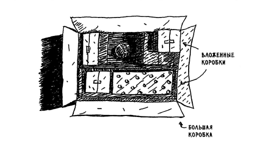

# Глава 3. рекурсия

## Задача:

Бабушка говорит, что ключ к чемодану, скорее всего, лежит в коробке. В коробке лежат другие коробки, а в них лежат маленькие коробочки. Ключ находится где-то там. Какой алгоритм поиска ключа предложите вы? Подумайте над алгоритмом, прежде чем продолжить чтение.



Одно из решений может выглядеть так:


Есть и альтернативное решение.


## Решение

Оба алгоритма реализованы в файле [search-key-in-box.js](search-key-in-box.js), описание ниже.

```js
/**
* Функция перебирает массив вложенных массивов в поиске sting
* с помощью цикла while и так называемой очереди, которая состоит
* из перебираемых массивов, и пополняется каждый раз,
* как массив текущей итерации не пустой.
* @param arr {array} - вложенные в друг друга массивы в которых производится поиск
* @returns {string|boolean} - строка, которая была найдена или false, если ни чего не нашлось
*/
function searchQueue(arr){}

/**
* Функция перебирает массив вложенных массивов
* в поиске sting с помощью рекурсии
* @param arr {array} - вложенные в друг друга массивы в которых производится поиск
* @returns {string|boolean} - строка, которая была найдена или false, если ни чего не нашлось
*/
function searchRecursion(arr) {}
```