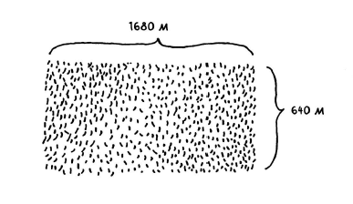

# Глава 4. Быстрая сортировки

## Задача:

4.1. Имеется массив чисел, например ```arr = [1,5,7,6,2]```. Нужно просуммировать все числа и вернуть сумму.

**Ответ на 4.1: [exercise-4.1.js](exercise-4.1.js), написано двумя способами, через цикл и через рекурсию**

4.2. Напишите рекурсивную функцию для подсчета количества элементов в списке.

**Ответ на 4.2: [exercise-4.2.js](exercise-4.2.js)**

4.3. Напишите функцию для поиска наибольшего числа в списке.

**Ответ на 4.3: [exercise-4.3.js](exercise-4.3.js), написано двумя способами, через цикл и через рекурсию**

4.4. Представьте, что вы фермер, владеющий земельным участком.



Вы хотите равномерно разделить землю на одинаковые *квадратные* участки. Участки должны быть настолько большими, насколько это возможно, так что ни одно из следующих решений не подойдет.


Как определить наибольший размер квадрата для участка? Воспользуйтесь стратегией "разделяй и властвуй"! Алгоритмы на базе этой стратегии являются рекурсивными.
