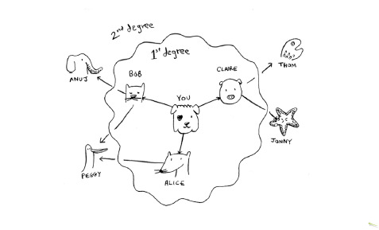

# Глава 4. Быстрая сортировки

## Задача:

Написать алгоритм поиска в ширину. Алгоритм должен возвращать минимальное количество шагов до искомого узла и путь-карту до искомого узла.

Алгоритм должен уметь работать с ненаправленными графами.

**Ответ: [exercise-6.js](exercise-6.js)**
