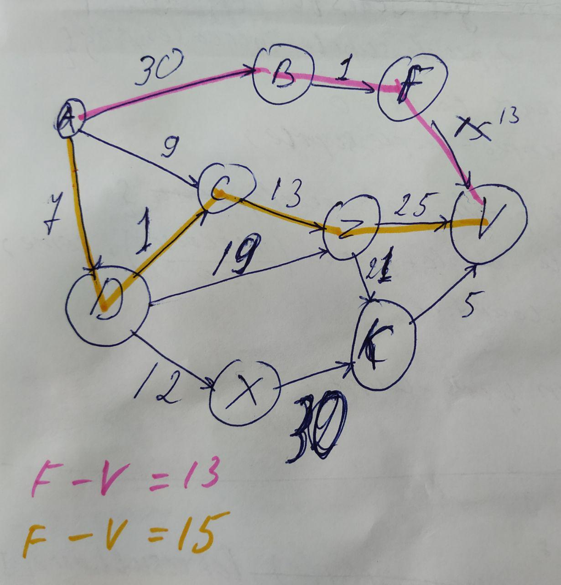

# Глава 4. Быстрая сортировки

## Задача:

Написать алгоритм Дейкстры, который вычисляет кротчайший путь во взвешенном графе. 

Алгоритм определяет, существует ли путь из А в В.

**Ответ: [exercise-7.js](exercise-7.js)**
